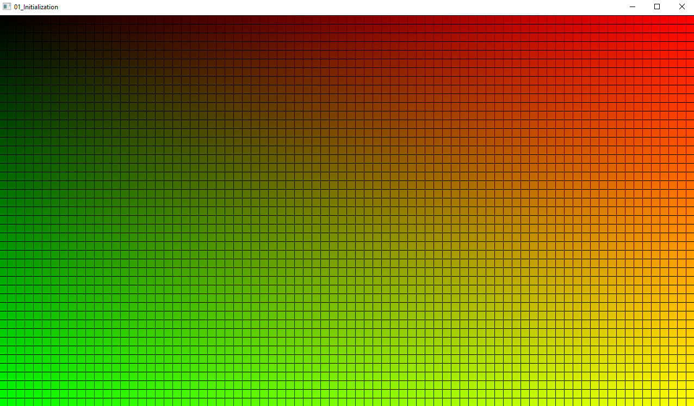

# Examples
These examples showcase functionality of WilloRHI.

For now they are acting as a form of documentation, this may change in the future.

### 01_Initialization
Basic application showcasing some features:
- API Initialization
- Bindless resource access in shaders
- Resource creation (shaders/pipelines, textures, texture views)
- Rendering using compute dispatch and blitting to swapchain

test_compute.slang is a translated version of gradient.comp from VkGuide.\
(https://github.com/vblanco20-1/vulkan-guide/blob/all-chapters-2/shaders/gradient.comp)

